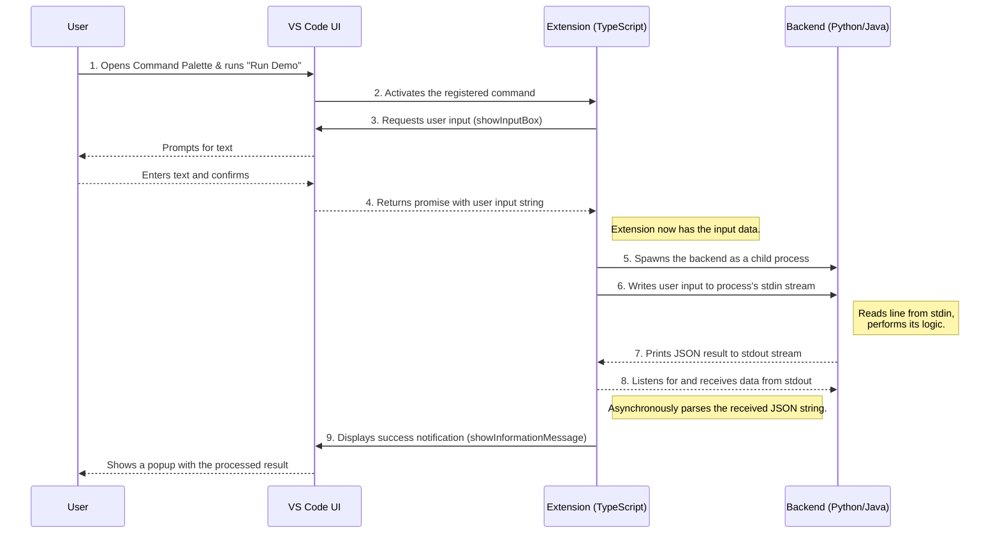

# 🚀 Ultimate Guide: Building a Hybrid VS Code Extension
### (TypeScript Frontend + Python/Java Backend)

This document provides a complete architectural overview and a detailed, step-by-step implementation guide for creating a powerful VS Code extension. The extension will use TypeScript for its user interface and integration with the VS Code API, while offloading complex logic to a separate backend process written in either Python or Java.

## 📋 Table of Contents

1.  [**🏗️ Core Architecture**](#️-part-1-core-architecture)
    *   [Conceptual Model](#conceptual-model)
    *   [Component Breakdown](#component-breakdown)
    *   [Architectural Diagram](#architectural-diagram)
2.  [**📊 Sequence of Operations**](#️-part-2-sequence-of-operations)
    *   [Event Flow](#event-flow)
    *   [Sequence Diagram](#sequence-diagram)
3.  [**🛠️ The Implementation Guide**](#️-part-3-the-implementation-guide)
    *   [Prerequisites](#prerequisites)
    *   [Step 1: Scaffolding the Extension](#step-1-scaffolding-the-extension)
    *   [Step 2: Creating the Backend Worker](#step-2-creating-the-backend-worker)
        *   [Option A: Python Backend](#option-a-python-backend)
        *   [Option B: Java Backend](#option-b-java-backend)
    *   [Step 3: Implementing the TypeScript Frontend](#step-3-implementing-the-typescript-frontend)
    *   [Step 4: Registering the Command](#step-4-registering-the-command)
    *   [Step 5: Running and Testing](#step-5-running-and-testing)
4.  [**🌟 From Demo to Production: Best Practices**](#️-part-4-from-demo-to-production-best-practices)

---

## 🏗️ Part 1: Core Architecture

### Conceptual Model

The hybrid extension architecture is a robust design pattern based on **Inter-Process Communication (IPC)**. It intelligently separates the responsibilities of the user interface from the core business logic or heavy computation.

*   **Extension Host (TypeScript):** This is the "frontend" running within VS Code's sandboxed environment. It is the sole component that interacts with the VS Code API. Its job is to manage the UI, capture user events, and orchestrate the backend process.
*   **Backend Worker (Python/Java):** This is a standalone command-line application that acts as the "backend." It is completely unaware of VS Code. It is designed to perform a specific task by reading from `stdin`, processing the data, and writing results to `stdout`.
*   **Communication Channel:** The two processes communicate through the operating system's standard I/O streams, using **JSON** as a structured and reliable data format.

### Component Breakdown

| Component | Technology | Responsibilities |
| :--- | :--- | :--- |
| **VS Code UI** | VS Code Shell | Renders UI elements (Command Palette, Input Boxes). Captures user events. |
| **Extension Host** | TypeScript/Node.js | • Registers commands, menus, and keybindings.<br>• **Spawns and manages the backend child process.**<br>• Writes user input to the backend's `stdin`.<br>• Listens for and parses JSON data from `stdout` and `stderr`.<br>• Displays results or errors to the user. |
| **Backend Worker**| Python / Java | • Runs as an independent process.<br>• Reads structured data from `stdin`.<br>• Performs its core logic (e.g., data analysis, heavy computation).<br>• **Prints a single line of JSON-formatted results to `stdout`.**<br>• Prints any errors as a JSON object to `stderr`. |

### Architectural Diagram

```mermaid
graph TD
    subgraph "User's VS Code Window"
        A[User] -->|Triggers Command| B(VS Code UI)
    end

    subgraph "Extension Host Process (Node.js)"
        B -->|Invokes Command| C{Extension Logic (TypeScript)}
        C -->|Spawns Process| D[Backend Worker (Python/Java)]
        C -->|"1. Writes input via stdin"| D
        D -->|"2. Writes result via stdout"| C
        D -->|"3. (Optional) Writes errors via stderr"| C
        C -->|"4. Displays result"| B
    end

    style C fill:#D6EAF8,stroke:#5DADE2,stroke-width:2px
    style D fill:#D5F5E3,stroke:#58D68D,stroke-width:2px
```

---

## 📊 Part 2: Sequence of Operations

### Event Flow
This sequence details the asynchronous, end-to-end flow from the user's initial action to the final result being displayed.

### Sequence Diagram

---

## 🛠️ Part 3: The Implementation Guide

### Prerequisites
*   **Visual Studio Code:** The editor itself.
*   **Node.js and npm:** The runtime for the extension.
*   **Python** or **Java JDK**: Depending on your chosen backend.
*   **Yeoman and VS Code Generator:** For scaffolding the project.
    ```bash
    npm install -g yo generator-code
    ```
## 📂 Project Setup (Works for All Extension Types)

### Step 1: Scaffolding the Extension
We'll use the official generator to create the basic project structure.
1. Open your terminal or command prompt. [name of the project : hybrid-demo]
2. Run the generator:
    ```bash
        yo code
    ```
3. You will be prompted with a series of questions. Answer them as follows:
    ```bash
    ? What type of extension do you want to create? New Extension (TypeScript)
    ? What's the name of your extension? hybrid-demo
    ? What's the identifier of your extension? hybrid-demo
    ? What's the description? A demo of a hybrid TS/Backend extension.
    ? Initialize a git repository? No
    ? Bundle the source code with webpack? Yes
    ? Which package manager to use? npm
    ```
4. This will create a new folder named py-ts-demo. Open this folder in VS Code:
    ```bash
    cd hybrid-demo
    code .
    ```

### Step 2: Implementing the TypeScript Frontend

Replace the contents of `src/extension.ts` with the following orchestrator code:

```typescript
// src/extension.ts
// This is a generic orchestrator for a hybrid VS Code extension.
// The code below is backend-agnostic: it works for both Python and Java backends with no changes required.
// Only the backendChoice variable and the corresponding spawn command need to be set to 'Python' or 'Java'.
// The rest of the logic (process spawning, data exchange, and result handling) remains identical for both languages.
// Each line is explained in detail below.

import * as vscode from 'vscode'; // Imports the VS Code Extension API, needed to interact with VS Code features.
import * as path from 'path'; // Node.js path utilities, used for building file paths in a cross-platform way.
import { spawn, ChildProcess } from 'child_process'; // Used to start external processes (Python/Java backend).

export function activate(context: vscode.ExtensionContext) { // This function is called when your extension is activated.

    // Registers a new command with VS Code.
    // vscode.commands.registerCommand takes two arguments:
    //   1. The unique command identifier (must match the one in package.json).
    //   2. The callback function to execute when the command is invoked.
    // This is required so that your extension can respond to user actions (e.g., from the Command Palette).
    let disposable = vscode.commands.registerCommand('hybrid-demo.runProcess', () => {

        // Choose which backend to use. Change this to 'Java' to use the Java backend.
        // This is the only part you need to change to switch between Python and Java.
        const backendChoice = 'Python';

        // Prompts the user for input using VS Code's input box UI.
        vscode.window.showInputBox({ prompt: `Enter text to process with ${backendChoice}` })
            .then(userInput => {
                if (!userInput) return; // If the user cancels or enters nothing, exit.

                let process: ChildProcess; // Will hold the spawned backend process.

                if (backendChoice === 'Python') {
                    // Build the path to the Python script relative to the extension's install location.
                    const scriptPath = path.join(context.extensionPath, 'scripts', 'process_data.py');
                    // Spawn a Python process to run the script.
                    process = spawn('python', [scriptPath]);
                } else { // Java backend
                    // Build the path to the Java backend directory.
                    const backendRoot = path.join(context.extensionPath, 'java_backend');
                    // Construct the Java classpath (bin directory and all jars in lib).
                    const classPath = [path.join(backendRoot, 'bin'), path.join(backendRoot, 'lib', '*')].join(path.delimiter);
                    // Spawn the Java process, running the Main class.
                    process = spawn('java', ['-cp', classPath, 'com.example.Main']);
                }

                // --- Universal Process Handling ---
                // This section is identical for both Python and Java backends.

                let stdout = '', stderr = ''; // Buffers to collect output and error messages.

                // Listen for data from the backend's stdout (the result).
                process.stdout!.on('data', (data) => stdout += data.toString());
                // Listen for data from the backend's stderr (errors).
                process.stderr!.on('data', (data) => stderr += data.toString());

                // When the backend process exits:
                process.on('close', (code) => {
                    if (code === 0) { // Success
                        // Parse the backend's JSON output.
                        const result = JSON.parse(stdout);
                        // Show a success message to the user in VS Code.
                        vscode.window.showInformationMessage(
                            `✅ Success from ${result.processed_by}! Reversed: "${result.reversed_text}" (Length: ${result.original_length})`
                        );
                    } else { // Error
                        // Show an error message to the user in VS Code.
                        vscode.window.showErrorMessage(`❌ Backend Error: ${stderr}`);
                    }
                });

                // Send the user's input to the backend process via stdin.
                process.stdin!.write(userInput + '\n');
                // Close the stdin stream to signal end of input.
                process.stdin!.end();
            });
    });

    // Adds the command to the extension's subscriptions so it is disposed automatically.
    context.subscriptions.push(disposable);
}

// This function is called when your extension is deactivated (cleanup if needed).
export function deactivate() {}
```

### Step 3: Creating the Backend Worker
Choose one of the following two options for your backend.

#### Option A: Python Backend
1.  Create the Python Backend Script
This script will be responsible for processing the data. It will read a line from its standard input, process it, and print the result to its standard output.
1. Inside your py-ts-demo project folder, create a new folder named scripts.
2. Inside the scripts folder, create a new file named process_data.py.
3. Add the following Python code to process_data.py:
    ```python
    # scripts/process_data.py
    import sys, json

    def process_data(input_text):
        return {
            "processed_by": "Python",
            "reversed_text": input_text[::-1],
            "original_length": len(input_text)
        }

    if __name__ == "__main__":
        try:
            for line in sys.stdin:
                result = process_data(line.strip())
                print(json.dumps(result))
                sys.stdout.flush() # CRITICAL: Ensures data is sent immediately
        except Exception as e:
            sys.stderr.write(json.dumps({"error": str(e)}))
            sys.stderr.flush()
    ```
4. Explanation:
- The script reads line by line from sys.stdin.
- It processes the input (reversing a string and getting its length).
-,It packages the result into a JSON object. Using JSON is a robust way to pass structured data.
- json.dumps(result) converts the Python dictionary to a JSON string.
- print(...) writes the JSON string to sys.stdout.
- sys.stdout.flush() is critical. It forces the output buffer to be written immediately, so the TypeScript parent process doesn't have to wait.
- Errors are written to sys.stderr, also as JSON.
#### Option B: Java Backend
1.  **Create folder structure & get library:**
    ```
    java_backend/
    ├── lib/      # Place org.json.jar here
    └── src/com/example/Main.java
    └── bin/      # Will be created by the compiler
    ```
    *   Download `org.json.jar` from [Maven Central](https://repo1.maven.org/maven2/org/json/json/) and place it in the `lib/` folder.

2.  **Add Java code:**
    ```java
    // java_backend/src/com/example/Main.java
    package com.example;
    import org.json.JSONObject;
    import java.io.BufferedReader;
    import java.io.InputStreamReader;

    public class Main {
        public static void main(String[] args) {
            try (BufferedReader reader = new BufferedReader(new InputStreamReader(System.in))) {
                String line;
                while ((line = reader.readLine()) != null) {
                    JSONObject result = new JSONObject();
                    result.put("processed_by", "Java");
                    result.put("reversed_text", new StringBuilder(line).reverse().toString());
                    result.put("original_length", line.length());
                    System.out.println(result.toString());
                }
            } catch (Exception e) {
                System.err.println(new JSONObject().put("error", e.getMessage()));
            }
        }
    }
    ```
3.  **Compile the Java code:** Open a terminal in the project root and run:
    ```bash
    # Create output directory
    mkdir -p java_backend/bin

    # Compile (use ';' instead of ':' for classpath on Windows)
    javac -d java_backend/bin -cp "java_backend/lib/*" java_backend/src/com/example/Main.java
    ```


### Step 4: Registering the Command
Update `package.json` to make the command visible in the Command Palette.
```json
// package.json
"contributes": {
  "commands": [
    {
      "command": "hybrid-demo.runProcess",
      "title": "Run Hybrid Process"
    }
  ]
},
```
### Final Folder Structure of the project
    ```bash
    hybrid-demo/
    ├── .vscode/
    │   ├── launch.json
    │   └── settings.json
    ├── scripts/
    │   └── process.py
    ├── src/
    │   ├── extension.ts
    │   └── utils.ts
    ├── java_backend/
    │        ├── lib/      # Place org.json.jar here
    │        └── src/com/example/Main.java
    │        └── bin/      # Will be created by the compiler    
    ├── package.json
    ├── tsconfig.json
    └── requirements.txt
    ```
### Step 5: Running and Testing
1.  **Important:** If testing Java, ensure you have compiled the code (Step 2).
2.  Press **`F5`** in VS Code to launch the **[Extension Development Host]** window.
3.  In the new window, press `Ctrl+Shift+P` (or `Cmd+Shift+P`).
4.  Type `Run Hybrid Process` and press Enter.
5.  Provide input and enjoy the result from your backend!

---

## 🌟 Part 4: From Demo to Production: Best Practices

| Concern | Best Practice |
| :--- | :--- |
| **Dependency Management** | **Python:** Ship a `requirements.txt` file. Your extension can help the user create a virtual environment (`venv`) and install dependencies into it.<br/>**Java:** Use **Maven** or **Gradle**. This automates dependency management and allows you to build a single, executable "fat JAR" (`java -jar your-app.jar`), which is far more robust. |
| **Executable Paths** | **Never hardcode `python` or `java`.** Add configuration settings in `package.json` so users can specify the path to their local executable. Read this path using `vscode.workspace.getConfiguration()`. |
| **Robust Error Handling** | The `stderr` stream is your friend. Use it to pass structured JSON error objects from the backend. This allows your TypeScript code to display rich, informative error messages instead of just a generic failure notice. |
| **Process Lifecycle** | For tools that are run frequently (like linters or formatters), spawning a new process each time is inefficient. Instead, spawn a **single, long-running process** when the extension activates and maintain a continuous conversation over `stdin`/`stdout`. |
| **Packaging & Distribution** | Use `vsce package` to create a `.vsix` file for distribution. Critically, ensure your backend assets (`scripts/`, `java_backend/bin/`, `java_backend/lib/`) are **not** listed in the `.vscodeignore` file, so they are included in the final package. |